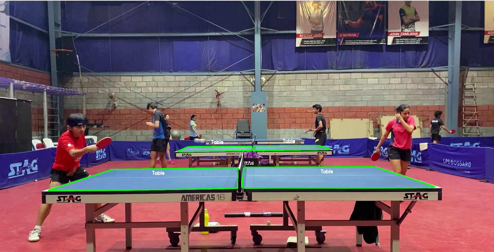

# TT Table detection:-

##Prerequisites :-

* [OpenCV]()
* [Matplotlib]()
* [Numpy]()


### Code to detect table:

Input path of video file(set2-1.MOV)

```
python3 table.py
```




### Code to track ball:

To make frames from video

```
python3 frame_writer.py
```

To track ball in frames

```
python3 tracker.py
```


    
